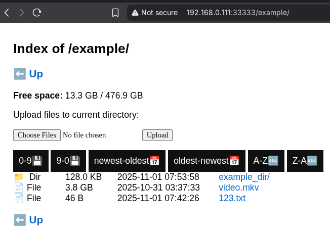

# meserve

This is a simple HTTP server written in Go. Currently, the program allows basic file browsing within a shared part of your filesystem.
In the file listing, you can sort by modification time, alphabetical order, and file size. Files can also be uploaded to the server, and they will be placed in the current directory displayed in the browser.



## Building and basic Usage

The server can be built with the Go compiler:
```bash
go build -ldflags="-s -w" -o meserve ./cmd/meserve
```
The Go compiler also allows specifying the target architecture. We can create a binary for ARMv8 and specify Android so the server can run in Termux:

```bash
GOOS=android GOARCH=arm64 go build -ldflags="-s -w" -o meserve-termux ./cmd/meserve
```
The simplest way to run the server:

```
./meserve
```

Run server on specified port with specified directory and allowed upload:

```
./meserve --port 3000 --serveDir /media/shared --enableUpload
```

## Usage with docker


Create image:
```
git clone https://github.com/matejeliash/meserve.git
cd meserve
docker build -t meserve .
```

Run container from image:
```
docker run --name <container_name> -p <host_port>:8080 -d  -v <served_dir>:/app/data meserve --serveDir /app/data --enableUpload
```
Example with custom container name, custom port and selected served directory:
```
docker run --name meserve_container -p 22222:8080 -d  -v /media/ssd:/app/data meserve --serveDir /app/data --enableUpload
```


## To-do
- [x] - create alpha version of server
- [x] - create initial fileHandler
- [x] - create initial uploadHandler
- [x] - add way to select root HTTP directory
- [ ] - add tests
- [x] - split code into more packages
- [ ]  put managment of terminal args out of main
- [ ]  add way for displayng free space in windows
- [ ] - change upload so alert prevents killing of window during upload
- [x] - fix all sorting methods that use javascript


To-do terminal args:
- [x] allow to select port
- [x] enable/disable upload
- [x] select server root dir
- [ ] allow to hide contrete parts of html like upload div
